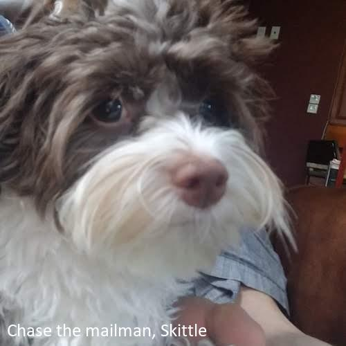

#Description
The project is a meme generator, which takes images and quotes as input, and outputs
an image resized to a standardized size with the quote placed at a random position.

The user can input their own images and quotes. If none are supplied, then a random
image and quote from the pre-existing library will be used.

The use can interface with the project in one of two ways, either from the command line, or 
a flask web-based interface.

#Attributions 

This is one of the final projects for the Udacity intermediate python nanodegree, completed 11/2021.
Udacity contributed basic project proposal, the raw data files, and two incomplete starter code module files, one
for each of the user interfaces (command line, web).

All other parts of the project, including the adaptable engine for importing texts, and the image manipulation engine,
were written by the author from scratch. The author also completed the starter code modules that assembled the engines.

#Requirements:
**xpdf:** This project contains a submodule that parses pdf texts for quotes.
It uses the Python subprocess module to call xpdf to convert a pdf file to txt.
To install xpdf, enter the following into a terminal:

```
sudo apt-get
sudo apt-get install -y xpdf
```

NOTE: Python has a pdftotext module that implements the same functionality.
However, PDF files are written using the subprocess module instead as a learning objective.

**Python Packages:** The full list of modules used at the time of the project
is written in the requirement.txt file. The most important are:

pandas - for reading quotes from CSV files

python-docx (import name docx) - for reading quotes from docx files

Pillow (import name PIL) - for editing images

Flask: for the web-based user interface.

requests: foe the web-based user interface.

**Fonts:** The font of the meme engine is set at default to 'calibri'. 
Pillow will automatically try to search for it in one of your system directories.
The font can be changed by changing the class attribute in the MemeEngine module.

**Image File Types:** Any image file type supported by Pillow will be supported, including JPG and PNG image types.

#Instructions for use

##Command-Line Interface
Run the following command line format, where '--arg {arg_string}' indicates an optional argument.

```
python3 meme.py --path {image_path} --body {quote_body} -- author {quote_author}
```

The return value is the path of the meme, saved to the default ./tmp folder.
The name of the meme is always 'meme_{original_file_name}'.

If no image path is provided, then a default image is chosen at random.

If no quote body is provided, then a default quote and author is chosen at random, regardless 
of whether an author is provided.

If an author is provided but not quote body, an error is raised.

Examples:
```
python3 meme.py
# your meme is at ./tmp/meme_xander_2.jpg
```
When no arguments are passed, a random meme is generated from a preexisting image and quote.

```
python3 meme.py --body 'any time is snack time' --author 'fluffy'
# your meme is at ./tmp/meme_xander_1.jpg
```
When a body and author is passed with no image path, your quote is captioned on a random preexisting image.

```
python3 meme.py --path '.../myimg.jpg'
# your meme is at ./tmp/meme_myimg.jpg'
```
When a path image is supplied and the meme is generated, the output is in .\tmp with
the meme file name the original file name modified by the prefix 'meme_'.

##Web Interface
This is currently being written and will be added shortly.

# Description and Customization of Modules

The project has two customizable engines - a quote import engine and an image manipulation engine that creates memes from
images and texts.

## QuoteEngine

The QuoteEngine module is responsible for importing quotes into the default quote library,
and the primary feature is that it is capable of expanding to support new file types with relatively
little modifications of code, by adding individual module files for each new file type.

To add a new file type to import, do the following.

1. Create a new Ingestor{EXT} file, where EXT is the extension of the new file type, whose contents
instantiate a concrete class for the abstract base class defined in 'IngestorInterface.py'. Fill our the 
new module according to the following template:
```
from .IngestorInterface import IngestorInterface, QuoteModel


class Ingestor{EXT}(IngestorInterface):
    """Concrete quote ingestor class for your custom filetype."""

    supported_formats = {'{EXT}'} # your custom extension goes here

    @classmethod
    def parse(cls, path: str) -> list[QuoteModel]:
        """Ingest the file in path and returns a list of QuoteModels of ingested Quotes."""
        if not cls.can_ingest(path):
            raise Exception(f'unsupported file format: requires{cls.supported_formats}')
            
        quotes=[]
        
        # write your function for importing quotes from files of your new file type from path. The new
        # quotes should be added to the container 'quotes', that is eventually returned.
        # An individual quote object is created by calling QuoteModel(body: str, author: str) where
        # body is the text of the quote and author is the author.

        return quotes

```

2. Modify the Ingestor.py strategy module to include your custom ingestor. Add the import to the top
of the file
```
from .Ingestor{EXT} import Ingestor{EXT}
```
and modify the Ingestor class attribute by adding your custom ingestor class:
```
ingestors = {IngestorCSV, IngestorPDF, IngestorDOCX, IngestorTXT}
ingestors.add{Ingestor{EXT}}
```

## MemeEngine

The MemeEngine.py file contains an image manipulator class MemeEngine that can produce customized output, according to the class
attribute parameters:

```
    meme_width = 500  # set the width of the meme
    meme_font = 'calibri'  # truetype font of the meme
    meme_fill = 'white'  # fill color for meme text
    meme_factor = 18  # how much smaller the font size is relative to width
```

The default settings are displayed above. Each MemeEngine object takes a quote and image, resizes the image to the width
setting while maintaining aspect ratio, and writes the quote to the image according to the font, color and text size
settings. The settings can be changed by modifying the class attributes.

Please note the font must be a truetype font that the meme engine will search for the font in one of your system's default libraries,
e.g. 'calibri' or 'arial'.

